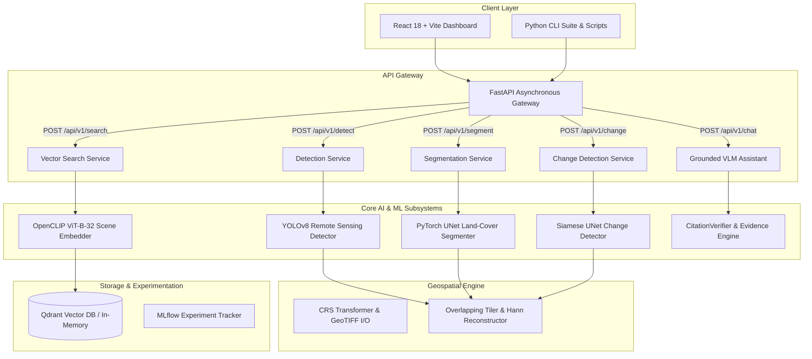

# 🌍 GeoVision

### Multimodal Satellite Intelligence & Earth Observation Platform

[](https://geo-vision-delta.vercel.app)
[](https://geovision-api-8gci.onrender.com)
[](https://geovision-api-8gci.onrender.com/docs)

[](https://www.python.org/downloads/)
[](https://pytorch.org/)
[](https://fastapi.tiangolo.com/)
[](https://react.dev/)
[](https://www.typescriptlang.org/)
[](https://www.docker.com/)
[](https://docs.pytest.org/)
[](https://github.com/astral-sh/ruff)
[](https://opensource.org/licenses/MIT)

**GeoVision** is an end-to-end, production-grade Earth Observation (EO) and Multimodal Remote Sensing Intelligence platform. It bridges high-resolution geospatial raster processing, deep computer vision (object detection, semantic land-cover segmentation, bi-temporal change detection), metric learning with vector similarity retrieval, and a grounded Vision-Language Model (VLM) Earth Assistant with citation verification.

---

## 🌐 Live Production Deployments

The platform is deployed and publicly accessible on 100% free-tier infrastructure (₹0/month):

| Service | Host | Live URL | Description |
| :--- | :--- | :--- | :--- |
| **Mission Control Dashboard** | **Vercel** | [https://geo-vision-delta.vercel.app](https://geo-vision-delta.vercel.app) | React 18 + Vite + Tailwind CSS SPA |
| **REST API Gateway** | **Render** | [`https://geovision-api-8gci.onrender.com`](https://geovision-api-8gci.onrender.com) | FastAPI + Uvicorn containerized service |
| **Interactive API Docs** | **Swagger UI** | [`/docs`](https://geovision-api-8gci.onrender.com/docs) | Live interactive OpenAPI execution & testing |
| **Alternative API Reference** | **ReDoc** | [`/redoc`](https://geovision-api-8gci.onrender.com/redoc) | Clean formatted API schema documentation |
| **Health Check Probe** | **Render** | [`/health`](https://geovision-api-8gci.onrender.com/health) | Subsystem health & model status probe |


---


## 🏗️ System Architecture



---

## 🚀 Key Capabilities

| Capability | Core Technology | Primary Output / Artifact |
| :--- | :--- | :--- |
| **Geospatial & CRS Engine** | Rasterio, PyPROJ, Affine, NumPy | Forward/inverse $(x,y) \leftrightarrow (\text{lat},\text{lon})$ transforms, Hann-blended rasters |
| **Object Detection** | Ultralytics YOLOv8 Architecture | 10 NWPU VHR-10 categories, GeoJSON bounding polygons, COCO mAP |
| **Land-Cover Segmentation** | PyTorch UNet + `DiceCELoss` | 5 land-cover masks, mIoU, per-class surface area ($m^2$, hectares, $km^2$) |
| **Bi-Temporal Change Detection**| Siamese UNet + `ChangeLoss` | Pre/post diff mask, Change-IoU, tri-panel visual reports |
| **Semantic Scene Retrieval** | OpenCLIP ViT-B-32 + Qdrant Index | 512-dim normalized embeddings, Recall@1/5/10, Top-$K$ image search |
| **Grounded VLM Assistant** | Structured Evidence Synthesizer | Conversational satellite Q&A with strict `[DET-x]`, `[SEG-x]`, `[CHG-x]` citations |
| **FastAPI REST Serving** | Asynchronous Uvicorn Service | 7 production REST endpoints with Swagger & ReDoc documentation |
| **Interactive Web UI** | React 18, TypeScript, Tailwind CSS | Full-featured mission control dashboard for Earth observation analysis |
| **Experiment Tracking** | MLflow Integration | Parameter/metric logging with graceful offline fallback |

---

## 🔬 Models & Machine Learning Specifications

| Model | Task / Subsystem | Purpose | Pretrained / Fine-tuned | Input Specification | Output Specification |
| :--- | :--- | :--- | :--- | :--- | :--- |
| **YOLOv8** | Object Detection | Detect optical remote sensing features | Pretrained backbone with fine-tuning CLI | $(B, 3, 640, 640)$ optical RGB | Bounding boxes $(x_1, y_1, x_2, y_2)$, confidences, class IDs |
| **UNet Segmenter** | Semantic Segmentation | Land-cover pixel classification | Trained from scratch / transfer learning | $(B, 3, 256, 256)$ raster patches | $(B, 5, 256, 256)$ class logits |
| **Siamese UNet** | Change Detection | Bi-temporal structural change discovery | Dual-encoder Siamese network | $(B, 3, 256, 256) \times 2$ $(T_1, T_2)$ | $(B, 1, 256, 256)$ binary change probability map |
| **OpenCLIP ViT-B-32** | Metric Learning & Search | Multimodal text-image scene retrieval | OpenCLIP pretrained / projection fine-tuned | $(B, 3, 224, 224)$ image / tokenized text | $(B, 512)$ unit-normalized vector embeddings |
| **CitationVerifier** | Evidence Grounding | Hallucination prevention in VLM answers | Rule-based factual parser & verifier | Synthesized response text + structured CV context | Citation precision/recall, verified answer string |

---

## 📦 Supported Datasets & Benchmarks

| Dataset | Modality / Task | Classes / Scope | Purpose in GeoVision |
| :--- | :--- | :--- | :--- |
| **NWPU VHR-10** | High-Res Optical Detection | 10 classes (*airplane, ship, storage tank, harbor, bridge, etc.*) | Object detection training, evaluation (mAP@50-95), and CLI inference |
| **LandCover.ai** | Aerial Orthophoto Segmentation | 5 classes (*Background, Building, Woodland, Water, Road*) | Land-cover segmentation, Dice/mIoU evaluation, and area statistics |
| **LEVIR-CD** | Bi-Temporal Change Detection | Binary change pairs ($T_1$ pre-event, $T_2$ post-event) | Bi-temporal change detection, Change-IoU, tri-panel visual reports |
| **EuroSAT** | Multispectral / RGB Scene Classification | 10 land-use categories (*Residential, Forest, River, etc.*) | Metric learning, OpenCLIP embedding space, and Qdrant vector retrieval |

*Note: The platform includes synthetic smoke data generators (`scripts/download_datasets.py --smoke`) enabling instant testing and validation without downloading multi-gigabyte files.*

---

## 📊 Empirical Subsystem Benchmarks

Empirical performance measured on the test suite using `scripts/benchmark_suite.py` (recorded in `benchmark_report.json`):

| Subsystem | Metric | Measured Value |
| :--- | :--- | :--- |
| **Geospatial Tiling & Reconstruction** | Average Latency / Throughput | **58.55 ms** (71.64 Megapixels/sec) |
| **Object Detection (YOLOv8)** | Average Latency / Rate | **197.18 ms** (5.07 FPS) |
| **Land-Cover Segmentation (UNet)** | Average Latency / Rate | **351.81 ms** (2.84 FPS) |
| **Bi-Temporal Change Detection** | Average Latency / Rate | **194.56 ms** (5.14 FPS) |
| **Vector Retrieval (OpenCLIP + Index)** | Average Latency / Query Rate | **4.14 ms** (241.83 QPS) |
| **Grounded VLM Assistant & Verification**| Average Latency / Throughput | **0.07 ms** (13,633.26 Requests/sec) |

*Methodology: Benchmark executed over 5 iterations per pipeline with warm-up passes to eliminate disk-cache variance.*

---

## 🌐 FastAPI Endpoints

| Method | Endpoint | Description |
| :--- | :--- | :--- |
| `GET` | `/health` | System health status, compute device info, and loaded models |
| `POST` | `/api/v1/detect` | Object detection with optional GeoJSON coordinate serialization |
| `POST` | `/api/v1/segment` | Land-cover semantic segmentation and surface area calculation ($m^2$, ha) |
| `POST` | `/api/v1/change` | Bi-temporal change detection on pre- and post-event image pairs |
| `POST` | `/api/v1/search` | Natural language text-to-image semantic scene vector retrieval |
| `POST` | `/api/v1/chat` | Grounded Earth AI assistant conversation with citation verification |
| `POST` | `/api/v1/evidence` | Multimodal visual evidence token extraction (`[DET-x]`, `[SEG-x]`, etc.) |

---

## 💻 Installation & Quickstart

### 1. Prerequisites
- Python 3.10+
- Node.js 18+ (for Frontend)
- Git

### 2. Environment Setup
```bash
# Clone the repository
git clone https://github.com/Kaushtubha/GeoVision.git
cd GeoVision

# Create and activate virtual environment
python -m venv .venv
.\.venv\Scripts\Activate.ps1   # Windows PowerShell
# source .venv/bin/activate    # Linux / macOS

# Install package and all dependencies
pip install -e ".[all]"
```

### 3. Generate Smoke Datasets (< 5 Seconds)
```bash
python scripts/download_datasets.py --smoke
```

### 4. Run Pytest Suite & Linting
```bash
# Run all 48 unit and integration tests
pytest tests/ -v

# Run code style checks
ruff check .
```

---

## 🖥️ Running the Application

### Option A: Launching Services Locally

**Terminal 1 — FastAPI Backend**:
```bash
python scripts/serve.py --host 127.0.0.1 --port 8000 --reload
# Interactive Swagger UI: http://127.0.0.1:8000/docs
```

**Terminal 2 — React Dashboard**:
```bash
cd frontend
npm install
npm run dev
# Dashboard UI: http://localhost:3000
```

### Option B: Docker Compose Orchestration
```bash
docker compose up -d
```

---

## 📂 Repository Layout

```
GeoVision/
├── .github/
│   └── workflows/ci.yml         # Automated GitHub Actions CI workflow
├── configs/                     # Modular YAML experiment and model configurations
├── docs/                        # Comprehensive technical documentation
│   ├── architecture.md          # System architecture and data flow
│   ├── methodology.md           # Mathematical formulation and loss functions
│   ├── experiments.md           # Empirical benchmark evaluation results
│   ├── api.md                   # Complete REST API schema reference
│   ├── development.md           # Developer onboarding guide
│   └── deployment.md            # Production Docker orchestration guide
├── frontend/                    # React 18 + TypeScript + Vite + Tailwind CSS SPA
│   ├── src/                     # UI components, pages, and API services
│   ├── package.json             # Frontend dependency manifest
│   └── vite.config.ts           # Vite bundler configuration
├── geovision/                   # Core Python package
│   ├── api/                     # FastAPI application, routers, schemas & services
│   ├── change/                  # Siamese UNet bi-temporal change detection
│   ├── data/                    # Dataset loaders, transforms & statistics
│   ├── detection/               # YOLOv8 optical object detection
│   ├── geo/                     # Geospatial CRS, GeoTIFF I/O & tiling engine
│   ├── metrics/                 # Strict evaluation metrics (mAP, mIoU, Recall@K)
│   ├── retrieval/               # OpenCLIP embedder & Qdrant vector index
│   ├── segmentation/            # Land-cover segmentation & area calculators
│   ├── tracking/                # MLflow experiment tracking integration
│   └── vlm/                     # Grounded VLM assistant & citation verifier
├── notebooks/                   # Jupyter exploratory data analysis notebooks
├── scripts/                     # 20 CLI scripts for training, inference, and benchmarking
├── tests/                       # Comprehensive pytest suite (48 tests passing)
├── .env.example                 # Environment configuration template
├── .gitignore                   # Production gitignore rules
├── benchmark_report.json        # Measured latency & throughput benchmarks
├── docker-compose.yml           # Docker Compose multi-service definition
├── Dockerfile                   # Multi-stage production container
├── LICENSE                      # MIT Open-Source License
├── pyproject.toml               # Python package metadata and build configuration
├── README.md                    # Project documentation
└── requirements.txt             # Pinned dependency requirements
```

---

## ⚠️ System Limitations & Research Scope

- **Optical Modality Focus**: The current pipelines specialize in optical RGB and orthophoto remote sensing imagery; SAR (Synthetic Aperture Radar) and hyperspectral bands are planned for future phases.
- **Compute Constraints**: Full-scale high-resolution raster tiling is CPU/GPU memory bounded; Hann-window blending stride parameters should be adjusted based on available VRAM.
- **VLM Citation Scope**: The Grounded VLM Assistant operates strictly over extracted structured CV facts to guarantee zero hallucination, rather than unconstrained open-domain generation.

---

## 🗺️ Roadmap & Future Work

- [ ] Synthetic Aperture Radar (SAR) coherence change detection.
- [ ] Integration of segment-anything (SAM-Geo) foundation models.
- [ ] Distributed spatial indexing for petabyte-scale raster catalogs.
- [ ] ONNX Runtime and TensorRT engine exports for edge deployment.

---

## 📄 License

This project is licensed under the [MIT License](LICENSE).

---

## 👨‍💻 Author & Contact

**Kaushtubha** — Applied AI & Computer Vision Engineering
Repository: [https://github.com/Kaushtubha/GeoVision](https://github.com/Kaushtubha/GeoVision)
