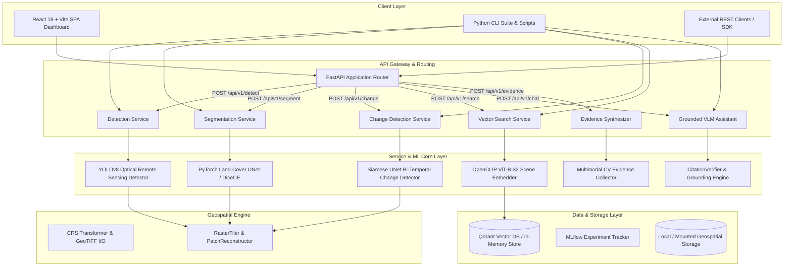

# 🏗️ GeoVision Architecture

This document provides an overview of the system architecture, component boundaries, and data flow of the **GeoVision** platform.

---

## 1. High-Level Architecture Diagram

---

## 2. Subsystem Descriptions

### 2.1 Geospatial & CRS Engine (`geovision.geo`)
- **`CoordinateTransformer`**: Handles forward and inverse conversions between raster pixel coordinates $(x, y)$ and Geographic/Projected coordinates (EPSG:4326 WGS84, UTM zones, EPSG:2180).
- **`GeoTIFFReader` / `GeoTIFFWriter`**: Reads georeferenced rasters, preserves affine transformation matrices and coordinate reference systems, and exports spatial metadata.
- **`RasterTiler` & `PatchReconstructor`**: Implements overlapping sliding-window inference with 2D Hann window blending to eliminate boundary artifacts across large-scale satellite orthophotos.

### 2.2 Computer Vision & Deep Learning Engines
- **Object Detection (`geovision.detection`)**: High-resolution optical feature detector across 10 remote sensing categories with bounding box extraction and GeoJSON serialization.
- **Land-Cover Segmentation (`geovision.segmentation`)**: Multi-class semantic segmenter predicting 5 classes (*Background, Building, Woodland, Water, Road*) with class distribution and surface area calculations ($m^2$, hectares, $km^2$).
- **Siamese Change Detection (`geovision.change`)**: Dual-encoder Siamese UNet architecture processing pre-event ($T_1$) and post-event ($T_2$) pairs to detect structural land modifications with tri-panel visualization.
- **Metric Learning & Vector Retrieval (`geovision.retrieval`)**: Normalized 512-dim OpenCLIP ViT-B-32 / lightweight vision-text projection embedder indexed in Qdrant for semantic scene discovery.

### 2.3 Grounded VLM Earth Assistant (`geovision.vlm`)
- **`EvidenceSynthesizer`**: Compiles visual discoveries into structured citations: `[DET-x]`, `[SEG-x]`, `[CHG-x]`, `[GEO-x]`, and `[RET-x]`.
- **`CitationVerifier`**: Factual verification layer computing citation precision, recall, and hallucination detection before returning answers.

### 2.4 Production Serving & Experimentation
- **FastAPI Layer (`geovision.api`)**: Async endpoints, Pydantic v2 validation schemas, dependency injection, and health monitoring.
- **MLflow Tracking (`geovision.tracking`)**: Structured metric logging and run lifecycle tracking with offline fallback.
